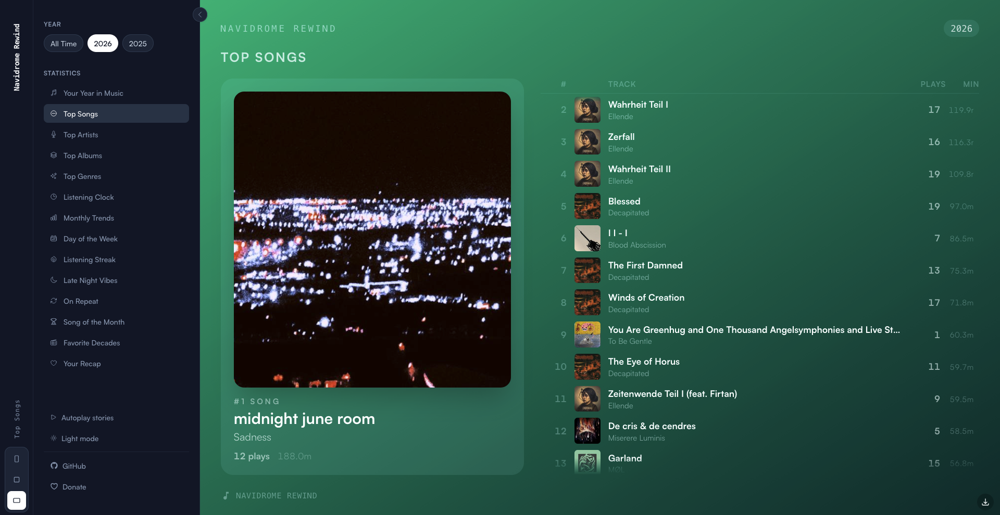
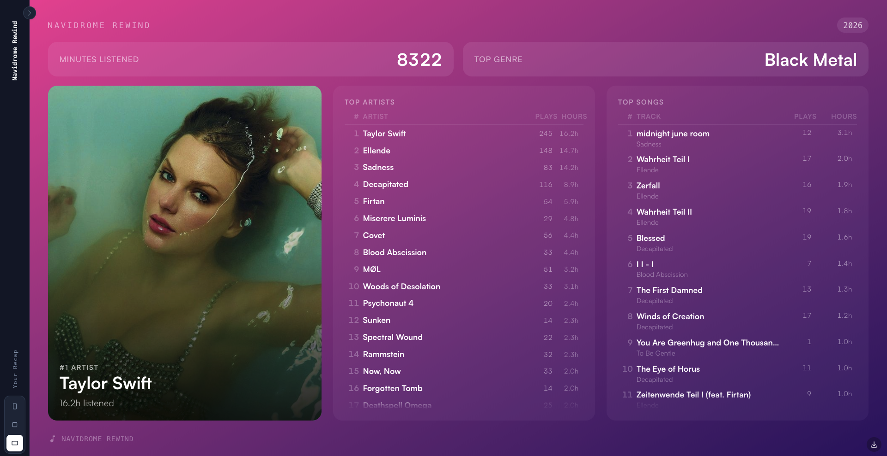
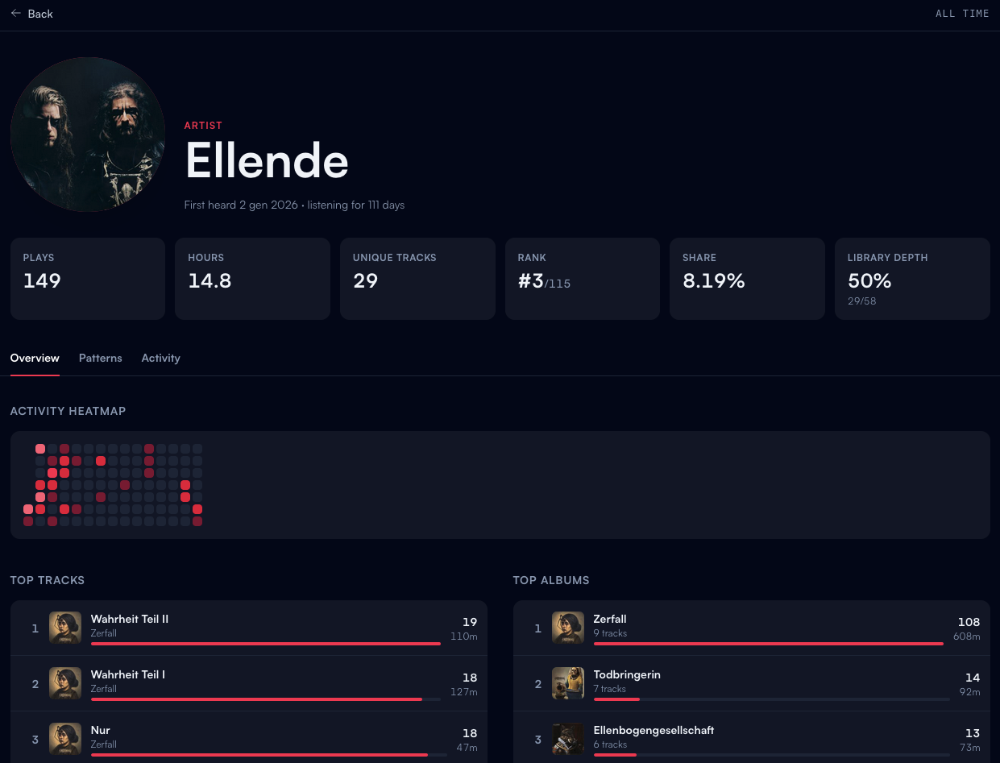

# Rewind

A self-hosted "Spotify Wrapped"-style experience for [Navidrome](https://www.navidrome.org/) users. Rewind reads from your Navidrome data directly and turns your scrobble history into a rich, visual recap of your listening habits, broken down by year or across all time.








## What you get

Rewind gives you a stories-style slideshow (think Instagram stories) that go through your personal stats: top songs, artists, albums, and genres, a listening clock that shows when you listen most, monthly trends, day-of-week breakdowns, your longest listening streaks, late-night favorites, songs you had on repeat, a "song of the month" for each month, and your favorite decades. Each card can be exported as a shareable image for your social media profiles.

## Requirements

- A running [Navidrome](https://www.navidrome.org/) instance with native scrobbling support (v0.59.0+)
- Access to the `navidrome.db` SQLite file (read-only is fine)
- Docker (recommended), or Node.js 22+

## Installation

### Docker Compose (recommended)

Create a `.env` file next to your `docker-compose.yml`:

```env
NAVIDROME_URL=http://your-navidrome-instance-ip:4533
NAVIDROME_BASE_PATH=/path/to/your/navidrome/data
NG_ALLOWED_HOSTS=localhost,127.0.0.1
SESSION_SECRET=some-random-secret
```

Then use the following compose file:

```yaml
services:
  rewind:
    image: bernardogiordano/rewind:latest
    container_name: rewind
    restart: unless-stopped
    ports:
      - "42000:4000"
    environment:
      - PORT=4000
      - NG_ALLOWED_HOSTS=${NG_ALLOWED_HOSTS:-localhost,127.0.0.1}
      - NAVIDROME_URL=${NAVIDROME_URL}
      - SESSION_SECRET=${SESSION_SECRET:-changeme}
      - DB_PATH=/data/navidrome.db
    volumes:
      - ${NAVIDROME_BASE_PATH}/navidrome:/data:ro
```

Start it up with `docker compose up -d` and open `http://localhost:42000` in your browser.

### Manual

Clone the repository and build the project:

```bash
npm install
npm run build
```

Create a `.env` file in the project root with the same variables listed above, then start the server:

```bash
npm run serve:ssr:rewind
```

The app will be available at `http://localhost:4000` by default.

## Configuration

| Variable | Description |
|---|---|
| `NAVIDROME_URL` | Base URL of your Navidrome instance (e.g. `https://music.example.com`) |
| `NAVIDROME_USER` | (Optional) Pin Rewind to a single Navidrome user — see _Authentication_ below |
| `NAVIDROME_API_KEY` | (Optional) Password / API key for the pinned user above |
| `SESSION_SECRET` | (Optional) Secret used to sign session cookies. If unset, Rewind generates one and persists it to `.rewind-session-secret` in the working directory. |

Cover art fetching requires `NAVIDROME_URL` to be set. If it's not, Rewind will still work; you just won't see album artwork on the cards.

## Authentication

Rewind supports two modes:

- **Single-user (transparent):** if both `NAVIDROME_USER` and `NAVIDROME_API_KEY` are set and resolve to a real Navidrome user, Rewind auto-logs in everyone who visits as that user.
- **Multi-user (login):** if either of those variables is missing, Rewind shows a login page where any Navidrome user can sign in with their username and password. Credentials are validated against your Navidrome instance via the Subsonic API. Sessions are stored in an encrypted, `HttpOnly` cookie and persist until logout.
