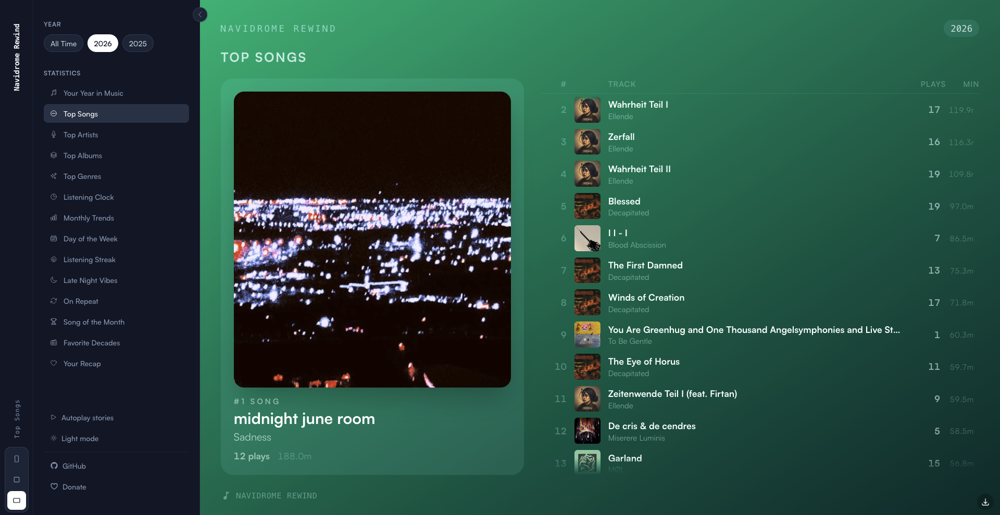
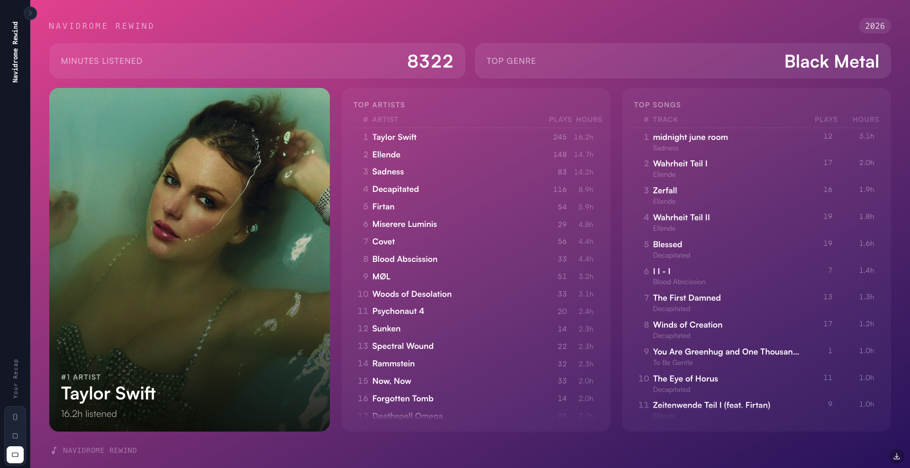
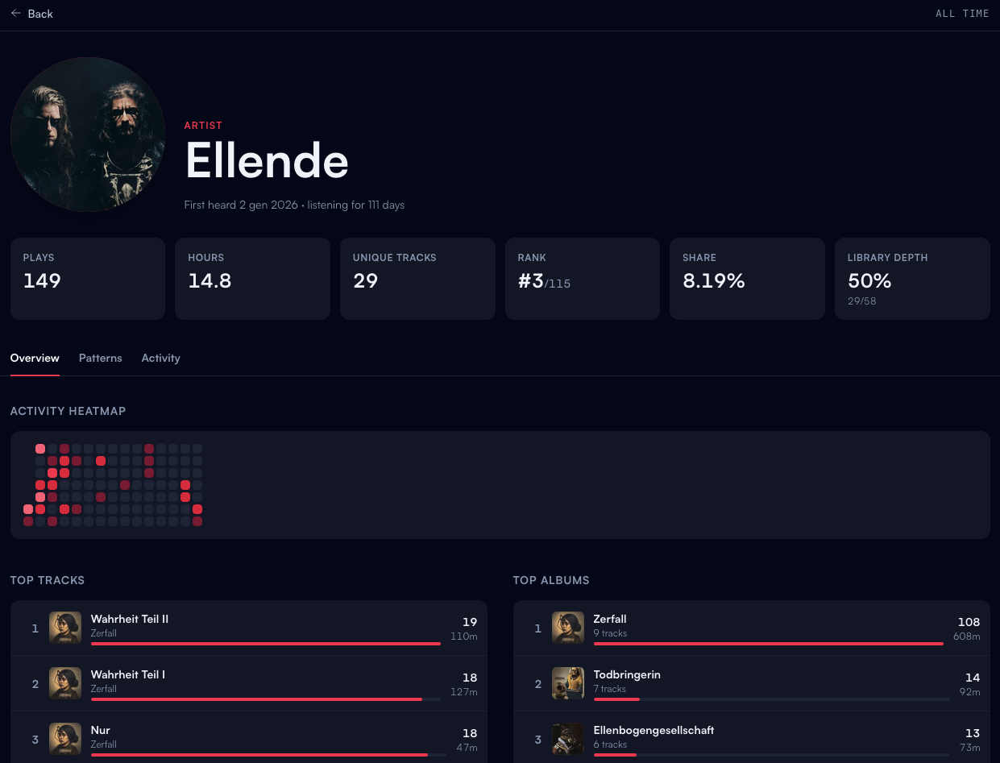
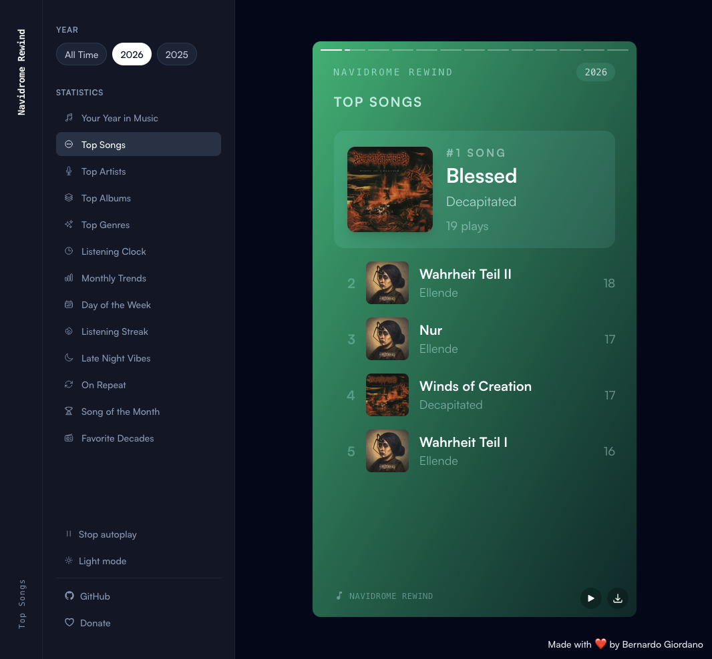
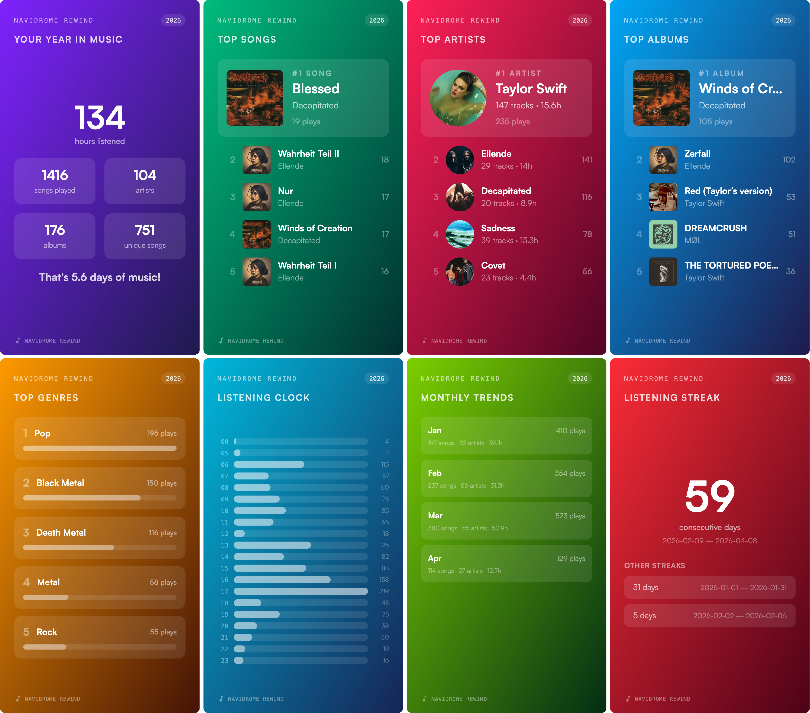

# Rewind

A self-hosted "Spotify Wrapped"-style experience for [Navidrome](https://www.navidrome.org/) users. Rewind reads from your Navidrome data directly and turns your scrobble history into a rich, visual recap of your listening habits, broken down by year or across all time.











## What you get

Rewind gives you a stories-style slideshow (think Instagram stories) that go through your personal stats: top songs, artists, albums, and genres, a listening clock that shows when you listen most, monthly trends, day-of-week breakdowns, your longest listening streaks, late-night favorites, songs you had on repeat, a "song of the month" for each month, and your favorite decades. Each card can be exported as a shareable image for your social media profiles.

Each slide plays a song from your library that fits it, streamed from Navidrome: your #1 song on top songs, the most-played song of your top artist, album, genre or decade, the song you played most in your busiest hour, weekday or month, or during your longest streak. Moving between slides crossfades to the next song. The speaker button next to the export button mutes the music, and hovering it opens a volume slider. Music needs `NAVIDROME_URL`. Browsers hold sound back until your first click or key press on the page.

## Library and manual scrobbles

Open **Library** to browse artists, albums, and songs, including music with no recorded listens.

Choose **Add scrobble** on a song or **Scrobble album** on an album. The date defaults to today in your browser's timezone and can be changed. For an album, select when you finished listening: Rewind previews a start time for each song in disc/track order using its duration. Confirm the preview to submit the listens to Navidrome.

Manual submissions require `NAVIDROME_URL`, valid user credentials, and Navidrome's scrobble history enabled. The mounted database must be the live database belonging to that Navidrome instance. Rewind keeps it read-only and submits through the Subsonic endpoint. Navidrome may also forward these listens to external scrobbling services configured for the user/player; those services apply their own historical-date rules.

Rewind checks the local history before reporting success. If only some records can be verified, the result is uncertain: check your listening history before trying again. There is no automatic retry or undo. Albums are limited to 1,000 available tracks per submission; missing files are excluded.

## Requirements

- A running [Navidrome](https://www.navidrome.org/) instance with native scrobbling support (v0.59.0+)
- Access to the `navidrome.db` SQLite file (read-only is fine)
- Docker (recommended), or Node.js 22+

## Installation

### Docker Compose (recommended)

Create a `.env` file next to your `docker-compose.yml`:

```env
NAVIDROME_URL=http://your-navidrome-instance-ip:4533
NAVIDROME_BASE_PATH=/path/to/your/navidrome/data
SESSION_SECRET=some-random-secret
```

Then use the following compose file:

```yaml
services:
  rewind:
    image: bernardogiordano/rewind:latest
    container_name: rewind
    restart: unless-stopped
    ports:
      - "42000:4000"
    environment:
      - PORT=4000
      - NAVIDROME_URL=${NAVIDROME_URL}
      - SESSION_SECRET=${SESSION_SECRET:-changeme}
      - DB_PATH=/data/navidrome.db
    volumes:
      - ${NAVIDROME_BASE_PATH}/navidrome:/data:ro
```

Start it up with `docker compose up -d` and open `http://localhost:42000` in your browser.

### Manual

Clone the repository and build the project:

```bash
npm install
npm run build
```

Create a `.env` file in the project root with the same variables listed above, then start the server:

```bash
npm start
```

The app will be available at `http://localhost:4000` by default.

## Development

The frontend in `web/` is an [srl](https://github.com/BernardoGiordano/srl) application. The Express server in `server/` serves the API, and in production the built frontend too.

```bash
npm run dev
```

This starts the API on port 4000 and the srl development server on `http://localhost:8000`, which proxies `/api` to the API and updates open pages as you edit. Run the checks and tests with:

```bash
npm run check
npm test
```

`npm run check` type-checks the JavaScript and every template, and `npm run build` writes the production frontend to `dist/web` and the server to `dist/server`.

## Configuration

| Variable | Description |
|---|---|
| `NAVIDROME_URL` | Base URL of your Navidrome instance (e.g. `https://music.example.com`) |
| `NAVIDROME_USER` | (Optional) Pin Rewind to a single Navidrome user — see _Authentication_ below |
| `NAVIDROME_API_KEY` | (Optional) Password / API key for the pinned user above |
| `SESSION_SECRET` | (Optional) Secret used to sign session cookies. If unset, Rewind generates one and persists it to `.rewind-session-secret` in the working directory. |

Cover art fetching requires `NAVIDROME_URL` to be set. If it's not, Rewind will still work; you just won't see album artwork on the cards.

## Authentication

Rewind supports two modes:

- **Single-user (transparent):** if both `NAVIDROME_USER` and `NAVIDROME_API_KEY` are set and resolve to a real Navidrome user, Rewind auto-logs in everyone who visits as that user.
- **Multi-user (login):** if either of those variables is missing, Rewind shows a login page where any Navidrome user can sign in with their username and password. Credentials are validated against your Navidrome instance via the Subsonic API. Sessions are stored in an encrypted, `HttpOnly` cookie and persist until logout.
